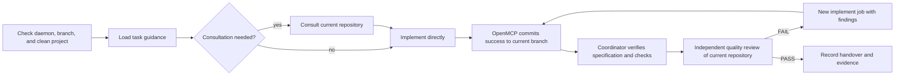

# Superpowers-CCG

A three-gate Plan → Execute → Review workflow for Claude Code, backed by durable
OpenMCP jobs. The agent loading the workflow becomes Coordinator. OpenMCP keeps
provider, model, target, and native session details out of user-facing prompts.

## Workflow



The canonical contract is
[`skills/coordinating-multi-model-work/SKILL.md`](skills/coordinating-multi-model-work/SKILL.md).
Specialized skills add only design, planning, debugging, TDD, execution, or
verification policy.

## Install

```bash
claude plugin marketplace add https://github.com/sitien173/superpowers-ccg
claude plugin install superpowers-ccg
```

### Prerequisites

- Claude Code
- Python 3.12+
- Git
- OpenMCP and configured backend CLIs

Start the local daemon:

```bash
openmcp doctor
openmcp serve
```

The plugin connects to `http://127.0.0.1:8765/mcp`.

## OpenMCP Configuration

OpenMCP uses three concepts:

- **workflow** — `implement`, `review`, or `consult`
- **profile** — maps each workflow directly to a target or ordered target list
- **target** — backend, model, and execution policy

Global daemon settings, targets, and profiles live in
`~/.openmcp/config.toml`:

```toml
[daemon]
host = "127.0.0.1"
port = 8765
max_jobs = 4
default_profile = "delivery"

[[targets]]
id = "implementation-primary"
backend = "codex"
backend_profile = "mcp_execution"
capabilities = ["code"]

[[targets]]
id = "consultation-primary"
backend = "pi"
isolated = true
read_only = true
capabilities = ["consult"]
system_prompt = "Provide concise software advice. Never modify files."

[[targets]]
id = "review-primary"
backend = "pi"
isolated = true
read_only = true
capabilities = ["review"]
system_prompt = "Return evidence-based code-quality findings. Never modify files."

[profiles.delivery]
implement = "implementation-primary"
consult = "consultation-primary"
review = "review-primary"
```

A list supplies ordered failover. Map all three workflows in every global
profile. Credentials belong in backend credential stores or environment
variables, never target fields or arguments.

Projects may override profiles, but not targets, in
`.openmcp/config.toml`. Commit that file before registration or submission.
OpenMCP now runs directly in the repository: Git-ignored files are visible to
workers and are never committed, reset, or restored. Do not keep secrets in
ignored files that a job can read, and do not rely on ignored-file snapshots.

### Task guidance

Configure semantic recommendations in `~/.openmcp/task_guide.json` or the
project-local `.openmcp/task_guide.json`:

```json
{
  "version": 1,
  "columns": ["use_case", "workflow", "profile", "reason"],
  "recommendations": [
    {
      "use_case": "Repository implementation",
      "workflow": "implement",
      "profile": "delivery",
      "reason": "Use the delivery implementation policy."
    },
    {
      "use_case": "Architecture or trade-off advice",
      "workflow": "consult",
      "profile": "delivery",
      "reason": "Use read-only consultation."
    },
    {
      "use_case": "Independent code-quality review",
      "workflow": "review",
      "profile": "delivery",
      "reason": "Use read-only quality review."
    }
  ]
}
```

`task_guide` returns recommendations; Coordinator matches them by meaning.
Only `workflow` and optional `profile` are submitted. Omit `profile` to use the
configured default. Guidance never names providers or target IDs.

## OpenMCP Lifecycle

The plugin uses:

- `status`, `reload`, `doctor`
- `project_register`, `task_guide`
- `job_submit`, `job_wait`, `job_retry`, `job_cancel`

Before orchestration, Coordinator requires `status: running`, resolves the Git
root through `openmcp://projects`, and registers only a clean repository on an
attached branch. `doctor` is read-only and used only when client integration
validation is requested.

OpenMCP exposes only three one-step workflows. A higher-risk change uses
sequential jobs:

```text
consult -> implement -> review
```

Each job sees the registered repository when it starts. Same-project jobs run in
FIFO order without overlap; different projects may run concurrently.
`implement` commits successful changes immediately to the current branch.
`review` and `consult` must leave the same clean HEAD. A review fix is a new
`implement` job whose prompt includes the findings.

Submit named fields rather than a generic input object:

```json
{
  "project_id": "project-uuid",
  "workflow": "implement",
  "prompt": "Implement the approved phase and run its verification checks.",
  "commit_message": "feat: implement approved phase",
  "context_key": "plan/phase-01/implement",
  "profile": "delivery"
}
```

Compact waits use `timeout_s: 30`. Coordinator inspects `job.result.text`,
`job.base_commit`, `job.result.commit`, and errors. Each submission represents
one complete job.

Before every job, the registered root must be clean on an attached branch. Do
not edit it while a job is queued or running. After an implementation succeeds,
Coordinator verifies the current root at the direct result commit and submits
review only if HEAD and tracked/non-ignored state remain unchanged.

Failed, cancelled, and interrupted jobs that started are restored by OpenMCP to
their saved base, except ignored files. A dirty-preflight failure leaves the
pre-existing changes untouched. `job_retry` reruns the whole immutable job; a
changed prompt requires a new submission.

Global target/profile edits require `reload`; fields reported in
`restart_required` need a daemon restart. Project profiles and task guidance
reload when used. Submitted jobs keep immutable execution plans.

## Resume Model

Executable plans live under `docs/plans/<slug>/`. `.handover.md` records the
project, phase base, context prefix, workflow/profile decisions, and latest
consultation, implementation, and review job IDs. Resume from
`openmcp://projects/<project_id>/jobs` before loading guidance for a new phase.
If a job is queued or running, wait without local repository edits. Stop rather
than resetting when handover, jobs, and current HEAD cannot be reconciled.

## Commands

- `/superpowers-ccg:brainstorm`
- `/superpowers-ccg:write-plan`
- `/superpowers-ccg:execute-plan`

## Development

```bash
tests/run.sh
```

Issues: https://github.com/sitien173/superpowers-ccg/issues
