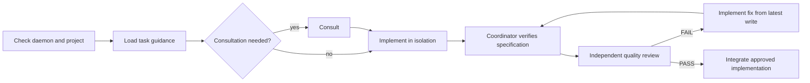

# Superpowers-CCG

A three-gate Plan → Execute → Review workflow for Claude Code, backed by durable
OpenMCP jobs. The agent loading the workflow becomes Coordinator. OpenMCP keeps
provider, model, target, and native session details out of user-facing prompts.

## Workflow



The canonical contract is
[`skills/coordinating-multi-model-work/SKILL.md`](skills/coordinating-multi-model-work/SKILL.md).
Specialized skills add only design, planning, debugging, TDD, execution, or
verification policy.

## Install

```bash
claude plugin marketplace add https://github.com/sitien173/superpowers-ccg
claude plugin install superpowers-ccg
```

### Prerequisites

- Claude Code
- Python 3.12+
- Git
- OpenMCP and configured backend CLIs

Start the local daemon:

```bash
openmcp doctor
openmcp serve
```

The plugin connects to `http://127.0.0.1:8765/mcp`.

## OpenMCP Configuration

OpenMCP uses three concepts:

- **workflow** — `implement`, `review`, or `consult`
- **profile** — maps each workflow directly to a target or ordered target list
- **target** — backend, model, and execution policy

Global daemon settings, targets, and profiles live in
`~/.openmcp/config.toml`:

```toml
[daemon]
host = "127.0.0.1"
port = 8765
max_jobs = 4
default_profile = "delivery"

[[targets]]
id = "implementation-primary"
backend = "codex"
backend_profile = "mcp_execution"
capabilities = ["code"]

[[targets]]
id = "consultation-primary"
backend = "pi"
isolated = true
read_only = true
capabilities = ["consult"]
system_prompt = "Provide concise software advice. Never modify files."

[[targets]]
id = "review-primary"
backend = "pi"
isolated = true
read_only = true
capabilities = ["review"]
system_prompt = "Return evidence-based code-quality findings. Never modify files."

[profiles.delivery]
implement = "implementation-primary"
consult = "consultation-primary"
review = "review-primary"
```

A list supplies ordered failover. Map all three workflows in every global
profile. Credentials belong in backend credential stores or environment
variables, never target fields or arguments.

Projects may override profiles, but not targets, in
`.openmcp/config.toml`. Commit that file before registration or submission.
Ignored-file overlays belong in `.openmcp.local.toml` and must use narrow,
Git-ignored paths without secrets.

### Task guidance

Configure semantic recommendations in `~/.openmcp/task_guide.json` or the
project-local `.openmcp/task_guide.json`:

```json
{
  "version": 1,
  "columns": ["use_case", "workflow", "profile", "reason"],
  "recommendations": [
    {
      "use_case": "Repository implementation",
      "workflow": "implement",
      "profile": "delivery",
      "reason": "Use the delivery implementation policy."
    },
    {
      "use_case": "Architecture or trade-off advice",
      "workflow": "consult",
      "profile": "delivery",
      "reason": "Use read-only consultation."
    },
    {
      "use_case": "Independent code-quality review",
      "workflow": "review",
      "profile": "delivery",
      "reason": "Use read-only quality review."
    }
  ]
}
```

`task_guide` returns recommendations; Coordinator matches them by meaning.
Only `workflow` and optional `profile` are submitted. Omit `profile` to use the
configured default. Guidance never names providers or target IDs.

## OpenMCP Lifecycle

The plugin uses:

- `status`, `reload`, `doctor`
- `project_register`, `task_guide`
- `job_submit`, `job_wait`, `job_retry`, `job_cancel`, `job_integrate`

Before orchestration, Coordinator requires `status: running`, resolves the Git
root through `openmcp://projects`, and registers only an absent, clean root.
`doctor` is read-only and used when integration validation is requested.

OpenMCP exposes only the three built-in workflows. Multi-step work uses job
chains, not project workflow files. A typical reviewed change is:

```text
implement -> review
```

If review fails, the next `implement` job uses the latest successful
implementation as its parent and receives the review findings in its prompt.
Read-only jobs have no commit and are never integrated.

Compact waits use `timeout_s: 30` and `include_stage_outputs: false`. Coordinator
reads `job.result.text`. Terminal jobs release execution worktrees, so
verification runs in a disposable detached worktree at the result commit.

Global target/profile edits require `reload`; fields reported in
`restart_required` need a daemon restart. Project profiles and task guidance
reload when used. Submitted jobs keep immutable execution plans.

## Resume Model

Executable plans live under `docs/plans/<slug>/`. `.handover.md` records the
project, phase base, context prefix, stage workflow/profile decisions, and
latest consult, implementation, and review job IDs. Resume from
`openmcp://projects/<project_id>/jobs` before loading guidance for a new phase.

## Commands

- `/superpowers-ccg:brainstorm`
- `/superpowers-ccg:write-plan`
- `/superpowers-ccg:execute-plan`

## Development

```bash
tests/run.sh
```

Issues: https://github.com/sitien173/superpowers-ccg/issues
