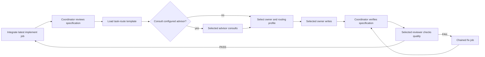

# Superpowers-CCG

Multi-agent orchestration for Claude Code. The agent loading this workflow
becomes Coordinator. Delegated agents use configured nicknames. Provider and
CLI identities remain private OpenMCP configuration.

| Field | Purpose |
|---|---|
| `recommend` | Public agent nickname |
| `role` | Owner, consultant, or reviewer responsibility |
| `execution_role` | Stable routing-profile and context role |

## Workflow



The canonical contract is
[`skills/coordinating-multi-model-work/SKILL.md`](skills/coordinating-multi-model-work/SKILL.md).

Coordinator is the primary role. It owns Plan, Execute, and Review. It delegates
consultation, implementation, and independent quality review.

## Install

```bash
claude plugin marketplace add https://github.com/sitien173/superpowers-ccg
claude plugin install superpowers-ccg
```

### Prerequisites

- Claude Code
- Python 3.12 or newer
- Git
- OpenMCP 1.2
- Provider CLIs configured inside OpenMCP

### Start OpenMCP

```bash
openmcp doctor
openmcp serve
```

The plugin connects to `http://127.0.0.1:8765/mcp`.

## Internal provider configuration

This example uses built-in execution roles. Workflow prompts and outputs use
configured nicknames. Models remain customizable per target.

```toml
[daemon]
host = "127.0.0.1"
port = 8765
max_jobs = 4
default_routing_profile = "balanced"

[[targets]]
id = "forge-primary"
backend = "codex"
profile = "mcp_execution"
capabilities = ["code"]

[[targets]]
id = "canvas-primary"
backend = "agy"
capabilities = ["code"]

[[targets]]
id = "sage-primary"
backend = "pi"
model = "gpt-5.6-sol"
reasoning = "high"
isolated = true
read_only = true
capabilities = ["consult", "reasoning"]
system_prompt = "Provide strategic software consultation. Follow only the current request. Never modify files. Return concise options, risks, and a recommendation."

[[targets]]
id = "sentinel-primary"
backend = "pi"
model = "gpt-5.6-sol"
reasoning = "high"
isolated = true
read_only = true
capabilities = ["review"]
system_prompt = "Provide independent code-quality review. Follow only the current request. Never modify files. Return evidence-based findings."

[[routes]]
id = "forge-balanced"
requires = ["code"]
targets = ["forge-primary"]

[[routes]]
id = "canvas-balanced"
requires = ["code"]
targets = ["canvas-primary"]

[[routes]]
id = "sage-balanced"
requires = ["consult"]
targets = ["sage-primary"]

[[routes]]
id = "sentinel-balanced"
requires = ["review"]
targets = ["sentinel-primary"]

[routing_profiles.balanced]
default = "forge-balanced"
implement = "forge-balanced"
consult = "sage-balanced"
review = "sentinel-balanced"

[routing_profiles.back_side_standard]
default = "forge-balanced"
implement = "forge-balanced"
consult = "sage-balanced"
review = "sentinel-balanced"

[routing_profiles.front_side_standard]
default = "canvas-balanced"
implement = "canvas-balanced"
consult = "sage-balanced"
review = "sentinel-balanced"
```

Every profile maps the built-in `implement`, `consult`, and `review` workflow
roles plus a `default`. OpenMCP routes each built-in workflow through the
profile's mapping for that role and still selects a target whose capability
matches the workflow permission. Point profile mappings at different routes and
targets. These names are only examples. Skills use the effective project default
unless the user pins an available profile.

- `balanced`: general delivery (default).
- `cost_optimized`: lower-cost targets.
- `back_side_standard` / `back_side_cost_optimized`: backend-oriented targets.
- `front_side_standard` / `front_side_cost_optimized`: frontend-oriented targets.

Define coordinator routing guidance in `~/.openmcp/task_routes.json`:

```json
{
  "version": 1,
  "columns": ["use_case", "recommend", "role", "execution_role", "reason"],
  "routes": [
    {"use_case": "Architecture advice", "recommend": "Advisor", "role": "consultant", "execution_role": "sage"},
    {"use_case": "Non-UI implementation", "recommend": "Builder", "role": "owner", "execution_role": "forge"},
    {"use_case": "UI implementation", "recommend": "Interface Builder", "role": "owner", "execution_role": "canvas"},
    {"use_case": "Quality review", "recommend": "Reviewer", "role": "reviewer", "execution_role": "sentinel"}
  ]
}
```

OpenMCP returns this template through `task_route`. Coordinator performs the
semantic breakdown and chooses agent names. OpenMCP does not classify words.
`execution_role` remains stable when nicknames change. The coordinator submits
the built-in `implement`, `consult`, or `review` workflow and validates it
against the project workflow resource. OpenMCP routes each built-in workflow
through the selected profile.

Default read-only consultant and reviewer targets use Pi's non-interactive mode.
OpenMCP passes
`--system-prompt`, `--no-context-files`, `--no-extensions`, `--no-skills`,
`--no-prompt-templates`, `--no-approve`, and a read-only tool allowlist.

## OpenMCP lifecycle

The plugin uses durable tools:

- `setup_instruction`
- `doctor`
- `project_register`
- `task_route`
- `job_submit`
- `job_wait`
- `job_retry`
- `job_cancel`
- `job_integrate`

Implementation submits the built-in `implement` workflow. Consultation submits
the built-in `consult` workflow. Independent review submits the built-in
`review` workflow. OpenMCP routes each built-in workflow through the selected
profile. Custom project workflows keep their own names. Every submission carries
a `routing_profile`.

Before first registration, call `setup_instruction` and follow its guidance:
read `openmcp://projects`, resolve the Git root, and register only when that
root is absent. Put optional project overrides in `.openmcp/config.toml` and
commit them:

```text
.openmcp/config.toml
```

Project configuration may override routes, profiles, and the default profile.
Targets and daemon settings remain global. Precedence is explicit submission,
project, global, then built-in defaults. Run `doctor` to validate the
integration without mutating anything.

Pass `project_id` to `task_route` for project guidance. Read effective profiles
from `openmcp://projects/<project_id>/routing-profiles`.

Call `job_wait` with `include_stage_outputs: false`. Read only
`job.result.text`. Terminal jobs release execution worktrees. Run verification
in a disposable detached worktree at `job.result.commit`.

New submissions reload configuration. Submitted jobs retain immutable routing
plans. Configuration changes never alter running jobs.

## Resume model

Executable plans live under `docs/plans/<slug>/`. Handover stores configured
nicknames, execution roles, the routing profile, context prefix, and latest job
identifiers. Resume through `openmcp://projects/<project_id>/jobs` before
resolving new routing.

## Commands

- `/brainstorm`
- `/write-plan`
- `/execute-plan`

## Development

```bash
tests/run.sh
```

## Support

Issues: https://github.com/sitien173/superpowers-ccg/issues
