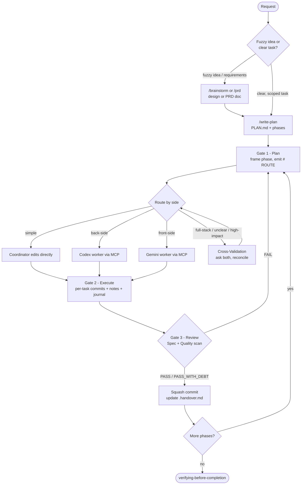
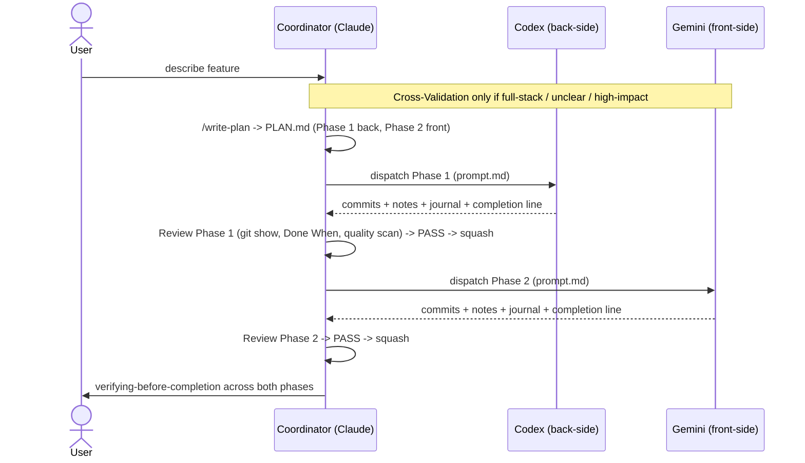
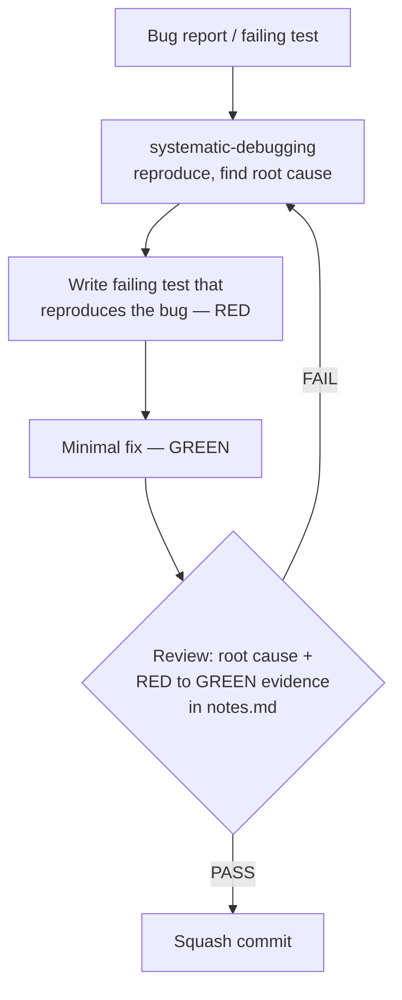
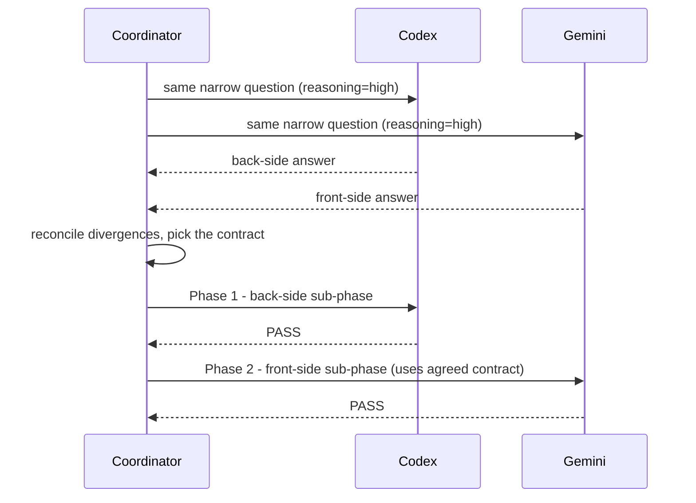
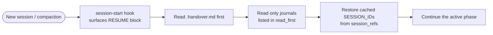

# Superpowers-CCG

Multi-model orchestration plugin for [Claude Code](https://docs.claude.com/docs/claude-code) and Codex. The host coordinator plans, routes, reviews, and handles simple edits. Heavier work is dispatched to **Codex** (back-side) or **Gemini** / **Antigravity** (front-side) through a single MCP tool.

> **CCG** = **C**laude + **C**odex + **G**emini

## Workflow

Three gates: **Plan → Execute → Review**.

1. **Plan** — for new features / ideation, run **Cross-Validation** first (ask Codex + Gemini the same narrow question, reconcile divergences). Then frame work as one phase: 2–4 tasks, file set, `Done When` checks. Output a `# ROUTE` block.
2. **Execute** — route by side (no default executor). Worker edits files via its own MCP write tools and returns `## FILES MODIFIED`.
3. **Review** — (a) Spec: run `Done When` + `git show <hash>` per task commit; (b) Quality scan on changed files (edge cases, error handling, security, naming, duplication, correctness). Output `# REVIEW` with `PASS` / `PASS_WITH_DEBT` / `FAIL`.

Severity downgrade: `CRITICAL`/`HIGH` force `FAIL`; `MEDIUM` downgrades `PASS` → `PASS_WITH_DEBT`; `LOW` is noted only. Quality scan is skipped for docs-only or trivial Claude edits, required for every Codex/Gemini phase.

Canonical spec: `skills/coordinating-multi-model-work/SKILL.md`.



## Routing

| Phase | Owner | Tool |
|---|---|---|
| Simple — one-line edit, rename, doc tweak, single-file fix | Coordinator | built-in |
| **Back-side** — backend, API, business logic, database, system, infra, CI/CD, scripts, server-side tests | Codex | `mcp__openmcp__run(backend="codex", ...)` |
| **Front-side** — UI, CSS, layout, motion, canvas/SVG, client interactions, multimodal, large-context UI/doc sweeps | Gemini | `mcp__openmcp__run(backend="gemini", ...)` |
| New feature / ideation (before plan exists) | Cross-Validation → assign side | both backends |
| Full-stack | split into back-side + front-side sub-phases | — |

User overrides ("use Codex", "skip cross-validation", "no external models") always win.

## Plan Artifacts

Multi-phase plans live in `docs/plans/<YYYY-MM-DD-slug>/`. Phase folders are created lazily — only `PLAN.md` and `.handover.md` exist at write time.

```
docs/plans/2026-05-21-user-auth/
  PLAN.md          # phases, ownership, Done When
  .handover.md     # resume pointer + cached worker SESSION_IDs
  phase-01/        # created when Phase 1 starts
    prompt.md      # dispatch spec for the worker
    notes.md       # decision notes, one ## Task <M> block per task
    journal.md     # Route → External Response → Review → Squash Commit
  phase-02/
    ...
```

Single-phase / docs-only work uses a flat file (`docs/plans/YYYY-MM-DD-<slug>-implementation-plan.md`) with no resume artifacts.

- **`.handover.md`** is the resume pointer (≤500 tokens). Always coordinator-authored, rewritten on every plan-state change. `session_refs` frontmatter caches Codex/Gemini `SESSION_ID`s and is updated after every MCP call that returns one.
- **`prompt.md`** holds the full dispatch spec; the MCP `PROMPT` field is just a pointer to it. Inline `PROMPT` only for one- or two-sentence asks.
- **`notes.md`** captures off-spec decisions, deviations, tradeoffs, assumptions, and follow-ups — appended per task by the worker. Empty sub-sections written as `- none`.
- **`journal.md`** is the durable phase record. The coordinator writes the Route skeleton at phase start; the worker appends the full `# EXTERNAL RESPONSE` block at phase end; the coordinator finalizes Review and Squash Commit sections after the Review gate.

## Worker Contract (Codex / Gemini)

- **One commit per task.** Message prefix `phase-<N>.task-<M>: <subject>`. Hashes returned in `## COMMITS`. After Review `PASS`, the coordinator squashes them into a single `phase-<N>: <summary>` commit (`git reset --soft HEAD~<count>`).
- **Per-task `notes.md` block** appended after each task — never batch-written at phase end.
- **`# EXTERNAL RESPONSE` block** appended to `journal.md` before the worker emits its terse completion line.
- **Same-phase fix:** reuse cached `SESSION_ID`, send `FIX:` + delta context only.

## Resume

A new session reads `.handover.md` first, then only the `journal.md` files listed in `read_first`. In Claude Code, the session-start hook surfaces an `<RESUME>` block when an `ACTIVE` handover exists. Codex uses the same handover artifacts through the shared skills but does not run the Claude Code hook.

## Install

### Claude Code

```bash
claude plugin marketplace add https://github.com/sitien173/superpowers-ccg
claude plugin install superpowers-ccg
```

### Codex

Add the Git marketplace, then install the plugin:

```bash
codex plugin marketplace add sitien173/superpowers-ccg-codex-marketplace --ref main
codex plugin add superpowers-ccg@superpowers-ccg-marketplace
```

### Prerequisites

- [Claude Code](https://docs.claude.com/docs/claude-code) — `claude --version`
- [Codex CLI](https://developers.openai.com/codex/quickstart) — `codex --version`
- [Gemini CLI](https://github.com/google-gemini/gemini-cli) — `gemini --version`
- [Antigravity CLI] `agy --version`
- `uv` / `uvx`

### MCP setup

A single unified server — [openmcp](https://github.com/sitien173/superpowers-ccg/tree/main/openmcp/openmcp) — exposes one tool, `mcp__openmcp__run`, with a `backend` field (`"codex"` or `"gemini"` or `"agy"`).

Environment resolution priority for OpenMCP defaults:

1. User environment variables
2. `~/.openmcp/.env`

### OpenMCP environment variables

| Variable | Purpose | Default |
|---|---|---|
| `OPENMCP_AGY_MODEL_DEFAULT` | Default `model` when `backend="agy"` and no model arg is passed | empty |
| `OPENMCP_CODEX_MODEL_DEFAULT` | Default `model` when `backend="codex"` and no model arg is passed | empty |
| `OPENMCP_GEMINI_MODEL_DEFAULT` | Default `model` when `backend="gemini"` and no model arg is passed | empty |
| `OPENMCP_CODEX_PROFILE_DEFAULT` | Default `profile` when `backend="codex"` and no profile arg is passed | `mcp-execution` |
| `OPENMCP_GEMINI_ROUTE_TO_AGY` | Routes `backend="gemini"` calls to `agy` when truthy (`1`, `true`, `yes`, `on`) | `false` |
| `OPENMCP_AGY_DISABLE_PLUGIN` | Plugin name to disable/restore around `agy` execution | `superpowers-ccg` |
| `OPENMCP_CODEX_DISABLE_PLUGIN` | Codex plugin selector disabled only for delegated `codex exec` workers; empty keeps all enabled | empty |
| `OPENMCP_LOG_FILE` | OpenMCP log file path | `~/.openmcp/openmcp.log` |
| `OPENMCP_LOG_LEVEL` | OpenMCP log level | `INFO` |

Reasoning-mode models are hardcoded in `openmcp/src/openmcp/server.py` (`_REASONING_MODELS`):
`agy → gemini-3.5-flash` (suffixed with `-<reasoning>`), `codex → gpt-5.5`, `gemini → gemini-3.1-pro-preview`.

Example `~/.openmcp/.env`:

```env
OPENMCP_AGY_MODEL_DEFAULT=gemini-3.5-flash
OPENMCP_CODEX_MODEL_DEFAULT=gpt-5.3-codex
OPENMCP_GEMINI_MODEL_DEFAULT=gemini-2.5-pro
OPENMCP_CODEX_PROFILE_DEFAULT=mcp_execution
OPENMCP_GEMINI_ROUTE_TO_AGY=false
OPENMCP_AGY_DISABLE_PLUGIN=superpowers-ccg
OPENMCP_CODEX_DISABLE_PLUGIN=superpowers-ccg@superpowers-ccg-marketplace
OPENMCP_LOG_FILE=~/.openmcp/openmcp.log
OPENMCP_LOG_LEVEL=INFO
```

Example plugin env (`.mcp.json`):

```json
{
  "mcpServers": {
    "openmcp": {
      "env": {
        "OPENMCP_AGY_MODEL_DEFAULT": "gemini-3.5-flash",
        "OPENMCP_CODEX_MODEL_DEFAULT": "gpt-5.3-codex",
        "OPENMCP_GEMINI_MODEL_DEFAULT": "gemini-2.5-pro",
        "OPENMCP_CODEX_PROFILE_DEFAULT": "mcp_execution",
        "OPENMCP_GEMINI_ROUTE_TO_AGY": "false",
        "OPENMCP_AGY_DISABLE_PLUGIN": "superpowers-ccg",
        "OPENMCP_CODEX_DISABLE_PLUGIN": "superpowers-ccg@superpowers-ccg-marketplace",
        "OPENMCP_LOG_FILE": "~/.openmcp/openmcp.log",
        "OPENMCP_LOG_LEVEL": "INFO"
      }
    }
  }
}
```

If you previously installed separate `codexmcp` / `geminimcp` servers, remove them:

```bash
claude mcp remove codex
claude mcp remove gemini
claude mcp remove agy
```

## Commands & Skills

Claude Code slash commands (each loads its skill before acting):

- `/brainstorm` — explore intent, requirements, and design via dialogue. Cross-Validation runs only when work is full-stack, unclear, or high-impact (not every new feature).
- `/prd` — turn rough product or technical requirements into a research-backed PRD (goals, non-goals, requirements, architecture, risks, milestones, acceptance criteria).
- `/write-plan` — turn a confirmed design into a phase-based plan.
- `/execute-plan` — run the active phase under the three gates.
- `/setup-openmcp-env` — interactively configure every `OPENMCP_*` env var and save to `~/.openmcp/.env`.

Shared skills discovered by Claude Code and Codex (namespace `superpowers-ccg:`):

- `coordinating-multi-model-work` — canonical 3-gate workflow, routing, review, resume artifacts.
- `brainstorming`, `writing-plans`, `executing-plans` — phase-stage skills loaded by the slash commands.
- `technical-prd-generator` — generate, improve, or review PRDs / technical specs; saves to `docs/plans/` and can hand off to `writing-plans`.
- `test-driven-development` — failing test first, watch it fail, then minimal code (feature/bugfix phases).
- `systematic-debugging` — root-cause investigation before any fix (bugs, test failures).
- `verifying-before-completion` — fresh verification evidence before reporting done.

## Hard Rules

- **Fail-closed.** Any MCP failure (timeout, unavailable, session-failed, permission-blocked, prompt too long) → output `BLOCKED` and ask the user. No silent retry, executor switch, or Task/Agent fallback.
- **Absolute paths only when calling `mcp__openmcp__run`.** The dispatch prompt pointer, the `cd` argument, and every file path inside the prompt body must be absolute (forward slashes on Windows). Gemini/agy mis-resolves relative paths and may scan the whole device.
- **One phase, one owner, one review.** No draft-then-reimplement handoffs.
- **Route by side.** No default executor; ambiguous side → ask user.

## Use Cases

Every flow runs through the same three gates; what changes is the entry point and how work is routed.

### 1. New / fresh project (greenfield)


1. **Install** the plugin and the Codex / Gemini backends (see [Install](#install)).
2. `/setup-openmcp-env` — choose models and write `~/.openmcp/.env`.
3. `/brainstorm "<product idea>"` (or `/prd "<requirements>"` for a formal spec) — produces a confirmed design / PRD under `docs/plans/`.
4. `/write-plan` — turns it into `PLAN.md` with phases split by side (back-side → Codex, front-side → Gemini).
5. `/execute-plan` — runs the active phase under the gates; repeat until every phase passes.
6. `verifying-before-completion` — final `Done When` evidence across all phases.

> Scope already clear? Skip `/brainstorm` and go straight to `/write-plan`.

### 2. New feature (existing codebase)

Example: *"Add user auth with email + password; UI on the settings page."*



- The coordinator decides the owner **by side**; a single-side feature skips Cross-Validation and routes straight to Codex or Gemini.
- Each worker edits files with its own tools, commits per task, and writes `notes.md` + the `# EXTERNAL RESPONSE` journal block. The coordinator never commits on the worker's behalf.

### 3. Bug fix / debugging



- Routed to the side that owns the buggy code; small, obvious fixes the coordinator handles directly.
- **Root cause before fix** (`systematic-debugging`) and **failing test first** (`test-driven-development`) are mandatory — the fix begins from a test that reproduces the bug, and the RED→GREEN evidence lands in `notes.md`.

### 4. Full-stack feature (Cross-Validation)

When a phase straddles both sides (shared API contract, schema, auth flow) or is high-impact:



- Cross-Validation **decides the contract once**, then the work splits into routed back / front sub-phases — never a single mixed phase.
- CV dispatches always pass `reasoning="high"`.

### 5. Resume after compaction / new session



- The handover artifacts (`.handover.md` + per-phase `journal.md`) are the durable state — a fresh session never re-scans every phase folder.
- In Claude Code the hook injects the `<RESUME>` block automatically; cached Codex / Gemini `SESSION_ID`s let in-flight worker sessions continue with `FIX:` deltas.

## Update

```bash
claude plugin update superpowers-ccg
codex plugin marketplace upgrade superpowers-ccg-marketplace
codex plugin add superpowers-ccg@superpowers-ccg-marketplace
```

## Support

Issues: https://github.com/sitien173/superpowers-ccg/issues

## Acknowledgments

- [obra/superpowers](https://github.com/obra/superpowers) — original Superpowers
- [BryanHoo/superpowers-ccg](https://github.com/BryanHoo/superpowers-ccg) — CCG fork
- [fengshao1227/ccg-workflow](https://github.com/fengshao1227/ccg-workflow) — CCG workflow
- [sitien173/superpowers-ccg (openmcp)](https://github.com/sitien173/superpowers-ccg/tree/main/openmcp/openmcp) — unified Codex + Antigravity (agy) MCP server
