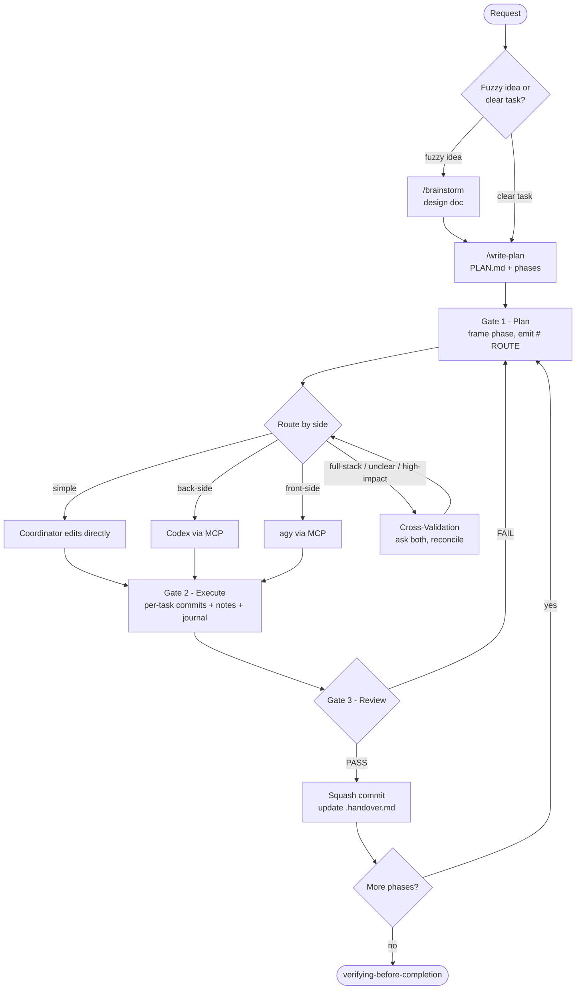

# Superpowers-CCG

Multi-model orchestration plugin for [Claude Code](https://docs.claude.com/docs/claude-code). The host **Coordinator** (Claude) plans, routes, reviews, and handles simple edits. Heavier work is dispatched to **Codex** (back-side) or **Antigravity / agy** (front-side) through a single MCP tool.

> **CCG** = **C**laude + **C**odex + **G**emini

## Workflow

Three gates: **Plan → Execute → Review**. Route each phase by **side** — no default executor. Use Cross-Validation only when work is full-stack, unclear, or high-impact.



**The canonical spec is [`skills/coordinating-multi-model-work/SKILL.md`](skills/coordinating-multi-model-work/SKILL.md)** — gates, routing table, review semantics, worker contract, and resume artifacts all live there. Everything else in this repo points to it.

User overrides ("use Codex", "skip cross-validation", "no external models") always win.

## Install

```bash
claude plugin marketplace add https://github.com/sitien173/superpowers-ccg
claude plugin install superpowers-ccg
```

### Prerequisites

- [Claude Code](https://docs.claude.com/docs/claude-code) — `claude --version`
- [Codex CLI](https://developers.openai.com/codex/quickstart) — `codex --version`
- Antigravity CLI — `agy --version`
- `uv` / `uvx`

### MCP setup

A single unified server — [openmcp](https://github.com/sitien173/openmcp) — exposes one tool, `mcp__plugin_superpowers-ccg_openmcp__run`, with a `backend` field (`"codex"` or `"agy"`). It is launched from `.mcp.json` via `uvx`.

Defaults resolve from: (1) user environment variables, then (2) the `env` block in `.mcp.json`.

| Variable | Purpose |
|---|---|
| `OPENMCP_AGY_MODEL_DEFAULT` | Default `model` for `backend="agy"` |
| `OPENMCP_CODEX_MODEL_DEFAULT` | Default `model` for `backend="codex"` |
| `OPENMCP_CODEX_PROFILE_DEFAULT` | Default Codex profile |
| `OPENMCP_AGY_REASONING_MODEL` | Model used for agy reasoning-mode calls |
| `OPENMCP_CODEX_REASONING_MODEL` | Model used for Codex reasoning-mode calls |
| `OPENMCP_LOG_FILE` | OpenMCP log file path (default `~/.openmcp/openmcp.log`) |
| `OPENMCP_LOG_LEVEL` | OpenMCP log level (default `INFO`) |

## Commands & Skills

Slash commands (each loads its shared skill before acting):

- `/brainstorm` — explore intent, requirements, and design via dialogue.
- `/write-plan` — turn a confirmed design into a phase-based plan.
- `/execute-plan` — run the active phase under the three gates.

Shared skills (namespace `superpowers-ccg:`):

- `coordinating-multi-model-work` — canonical 3-gate workflow, routing, review, resume artifacts.
- `brainstorming`, `writing-plans`, `executing-plans` — phase-stage skills loaded by the slash commands.
- `test-driven-development` — failing test first, then minimal code (feature/bugfix phases).
- `systematic-debugging` — root-cause investigation before any fix.
- `verifying-before-completion` — fresh verification evidence before reporting done.

## Plan artifacts

Multi-phase plans live in `docs/plans/<slug>/` (`PLAN.md` + `.handover.md`; `phase-NN/` folders created lazily). `.handover.md` is the resume pointer — a new session reads it first, then only the journals it lists. Single-phase / docs-only work uses a flat `docs/plans/<slug>-implementation-plan.md`. See the canonical skill for the full schema.

## Update

```bash
claude plugin update superpowers-ccg
```

## Support

Issues: https://github.com/sitien173/superpowers-ccg/issues

## Acknowledgments

- [obra/superpowers](https://github.com/obra/superpowers) — original Superpowers
- [BryanHoo/superpowers-ccg](https://github.com/BryanHoo/superpowers-ccg) — CCG fork
- [fengshao1227/ccg-workflow](https://github.com/fengshao1227/ccg-workflow) — CCG workflow
- [sitien173/openmcp](https://github.com/sitien173/openmcp) — unified Codex + Antigravity (agy) MCP server
