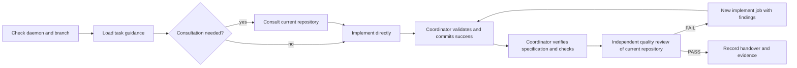

# Superpowers-CCG

A three-gate Plan → Execute → Review workflow for Claude Code, backed by durable
OpenMCP jobs. The agent loading the workflow becomes Coordinator. OpenMCP keeps
provider, model, target, and native session details out of user-facing prompts.

## Workflow


```mermaid
flowchart LR
    A[Check daemon and branch] --> G[Load task guidance]
    G --> C{Consultation needed?}
    C -->|yes| D[Consult current repository]
    C -->|no| I[Implement directly]
    D --> I
    I --> K[Coordinator validates and commits success]
    K --> S[Coordinator verifies specification and checks]
    S --> R[Independent quality review of current repository]
    R -->|FAIL| F[New implement job with findings]
    F --> K
    R -->|PASS| H[Record handover and evidence]
```

The canonical contract is
[`skills/coordinating-multi-model-work/SKILL.md`](skills/coordinating-multi-model-work/SKILL.md).
Specialized skills add only design, planning, debugging, TDD, execution, or
verification policy.

## Install

```bash
claude plugin marketplace add https://github.com/sitien173/superpowers-ccg
claude plugin install superpowers-ccg
```

### Prerequisites

- Claude Code
- Python 3.12+
- Git
- OpenMCP and configured backend CLIs

Start the local daemon:

```bash
openmcp serve
```

The plugin connects to `http://127.0.0.1:8765/mcp`.

## OpenMCP Configuration

OpenMCP uses three concepts:

- **workflow** — `consult`, `implement`, `other`, or `review`
- **profile** — maps each workflow directly to a target or ordered target list
- **target** — backend, model, and execution policy

Global daemon settings, targets, and profiles live in
`~/.openmcp/config.toml`:

```toml
[daemon]
host = "127.0.0.1"
port = 8765
max_jobs = 4
default_profile = "delivery"

[[targets]]
id = "implementation-primary"
backend = "codex"
backend_profile = "mcp_execution"

[[targets]]
id = "consultation-primary"
backend = "pi"
isolated = true
read_only = true
system_prompt = "Provide concise software advice. Never modify files."

[[targets]]
id = "review-primary"
backend = "pi"
isolated = true
read_only = true
system_prompt = "Return evidence-based code-quality findings. Never modify files."

[profiles.delivery]
implement = "implementation-primary"
consult = "consultation-primary"
review = "review-primary"
other = "implementation-primary"
```

A list supplies ordered failover. Profiles may be partial. Map every workflow
the profile must support. Missing mappings fail during plan resolution.
`other` requires an explicit mapping and never falls back. Credentials belong
in backend credential stores or environment variables, never target fields or
arguments.

Projects may override profiles, but not targets, in
`.openmcp/config.toml`. Commit that file before registration or submission.
OpenMCP now runs directly in the repository and never commits, resets, or
restores any file; Git-ignored files are equally visible to workers. Do not keep
secrets in ignored files that a job can read, and do not rely on any file being
restored after a job.

### Task guidance

Configure semantic recommendations in `~/.openmcp/task_guide.json` or the
project-local `.openmcp/task_guide.json`:

```json
{
  "version": 1,
  "columns": ["use_case", "workflow", "profile", "reason"],
  "recommendations": [
    {
      "use_case": "Repository implementation",
      "workflow": "implement",
      "profile": "delivery",
      "reason": "Use the delivery implementation policy."
    },
    {
      "use_case": "Architecture or trade-off advice",
      "workflow": "consult",
      "profile": "delivery",
      "reason": "Use read-only consultation."
    },
    {
      "use_case": "Independent code-quality review",
      "workflow": "review",
      "profile": "delivery",
      "reason": "Use read-only quality review."
    },
    {
      "use_case": "Other explicitly supported work",
      "workflow": "other",
      "profile": "delivery",
      "reason": "Use the profile's explicit catch-all route."
    }
  ]
}
```

`task_guide` returns recommendations; Coordinator matches them by meaning.
Only `workflow` and optional `profile` are submitted. Omit `profile` to use the
configured default. Guidance never names providers or target IDs.

## OpenMCP Lifecycle

The plugin uses:

- `status`
- `project_register`, `task_guide`
- `job_submit`, `job_wait`, `job_retry`, `job_cancel`

Before orchestration, Coordinator requires `status: running`, resolves the Git
root through `openmcp://projects`, and registers it on an attached branch.
OpenMCP does not check cleanliness; a dirty tree does not block submission.

OpenMCP exposes four one-step workflows. This plugin's canonical gates use
three of them. A higher-risk change uses sequential jobs:

```text
consult -> implement -> review
```

`other` remains an explicit catch-all route. Use it only when task guidance
selects it.

Each job runs in the registered directory when it starts and leaves every
filesystem change in place. Same-project jobs run in FIFO order without overlap;
different projects may run concurrently. Coordinator validates the resulting
changes and commits a successful `implement` to the current branch. `review` and
`consult` run against read-only targets so they cannot mutate files. A review
fix is a new `implement` job whose prompt includes the findings.

Submit named fields rather than a generic input object:

```json
{
  "project_id": "project-uuid",
  "workflow": "implement",
  "prompt": "Implement the approved phase and run its verification checks.",
  "context_key": "plan/phase-01/implement",
  "profile": "delivery"
}
```

Compact waits use `timeout_s: 30`. Coordinator reads `job.result.text` on
success and `job.result.error` on failure. Each submission represents one
complete job.

Do not edit the root while a job is queued or running. After an implementation
job is terminal, Coordinator inspects the actual filesystem changes, runs the
phase validation, commits the reconciled diff, and only then submits review.

OpenMCP never commits, resets, or restores. Changes from failed, cancelled, and
interrupted jobs remain on disk; Coordinator inspects and reconciles them. A
`job_retry` reruns the whole immutable job without resetting the tree, so
reconcile existing changes first; a changed prompt requires a new submission.

Global target/profile edits require `reload`; fields reported in
`restart_required` need a daemon restart. Project profiles and task guidance
reload when used. Submitted jobs keep immutable execution plans.

## Resume Model

Executable plans live under `docs/plans/<slug>/`. `.handover.md` records the
project, phase base, context key, workflow/profile decisions, and latest
consultation, implementation, and review job IDs. Resume from
`openmcp://projects/<project_id>/jobs` before loading guidance for a new phase.
If a job is queued or running, wait without local repository edits. Stop rather
than resetting when handover, jobs, and current HEAD cannot be reconciled.

## Commands

- `/superpowers-ccg:brainstorm`
- `/superpowers-ccg:write-plan`
- `/superpowers-ccg:execute-plan`

## Development

```bash
tests/run.sh
```

Issues: https://github.com/sitien173/superpowers-ccg/issues
