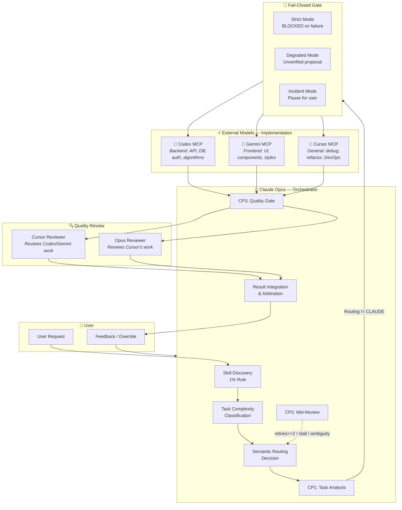
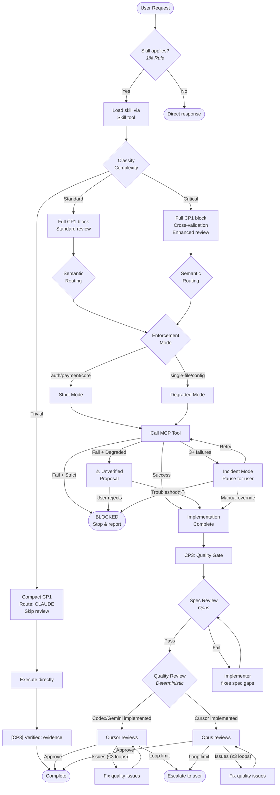
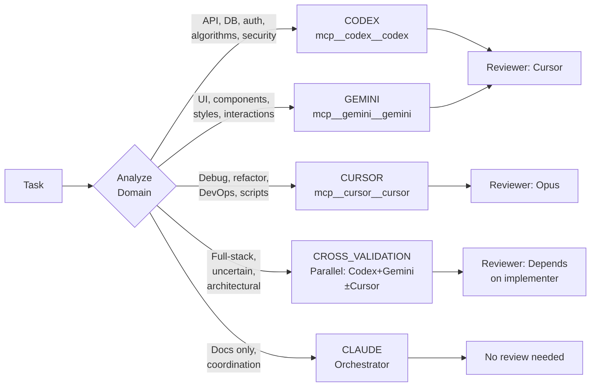
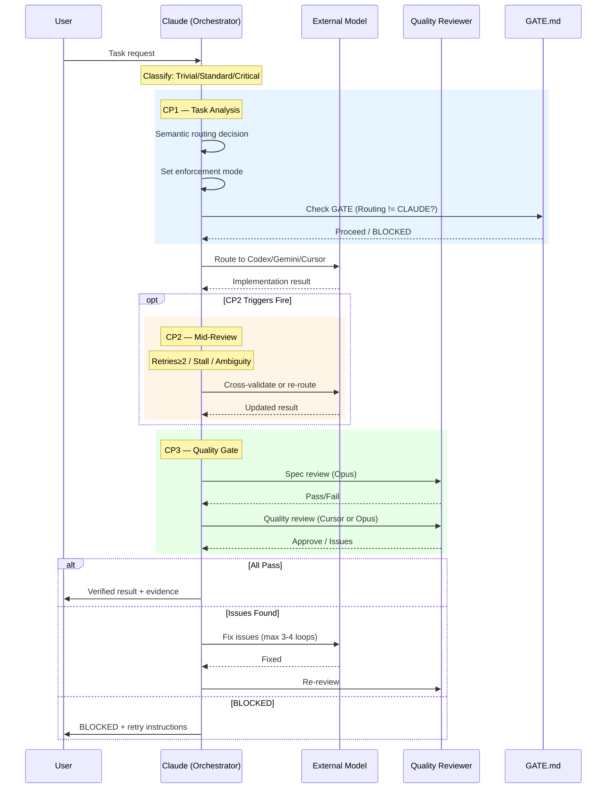
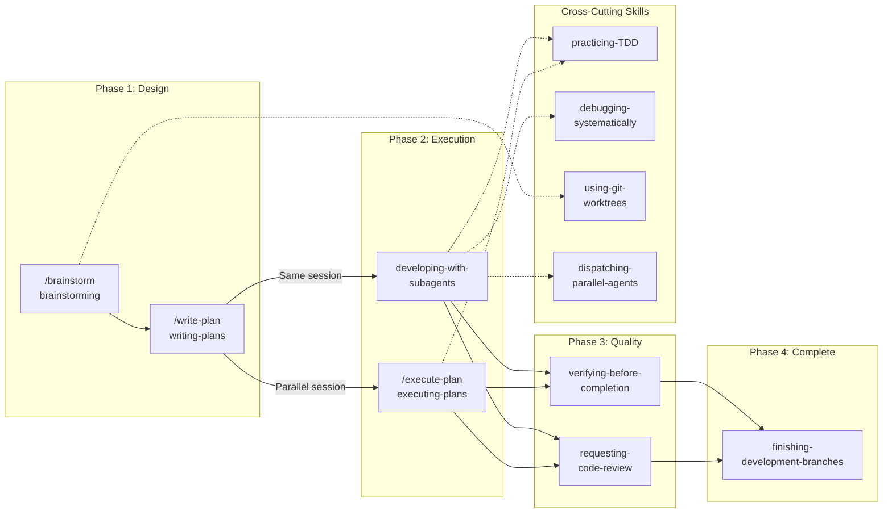
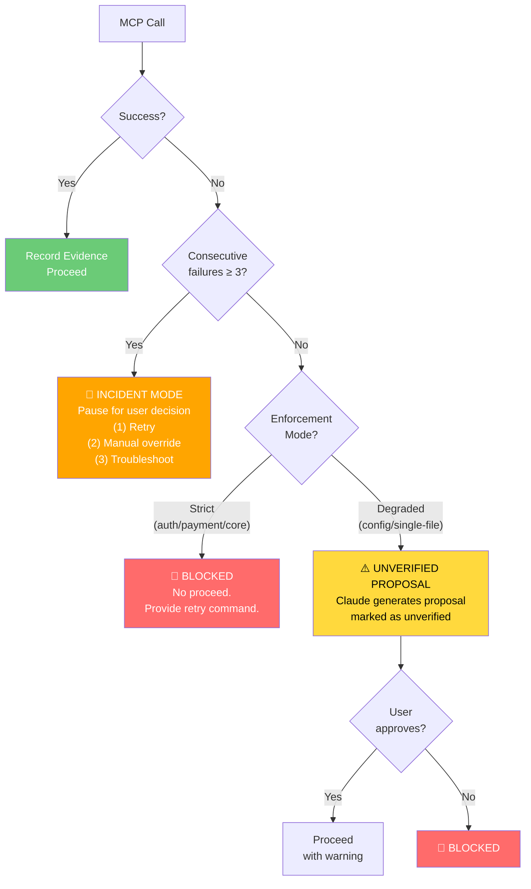

# CCCG Workflow Architecture Diagrams

> Generated from 3-way CROSS_VALIDATION (Codex + Gemini + Cursor) analysis on 2026-03-24.
> Render with any Mermaid-compatible tool (GitHub, VS Code, mermaid.live).

---

## 1. High-Level System Architecture

---

## 2. Complete Task Lifecycle (Step-by-Step)

---

## 3. Multi-Model Routing Decision Tree

---

## 4. Checkpoint Protocol Flow

---

## 5. Skills Composition Pipeline

---

## 6. Enforcement Modes & Failure Handling

