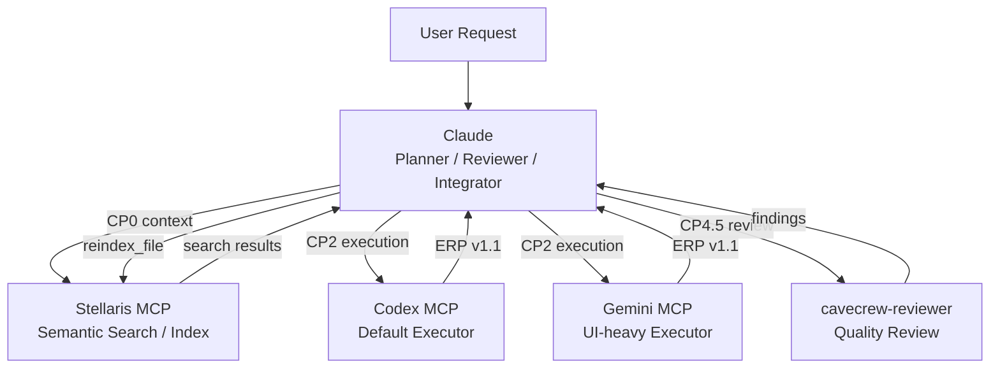
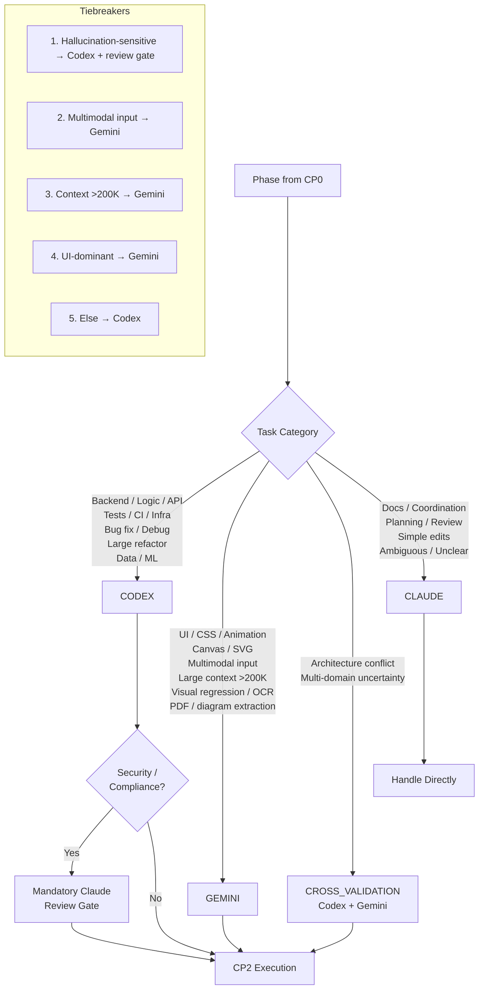
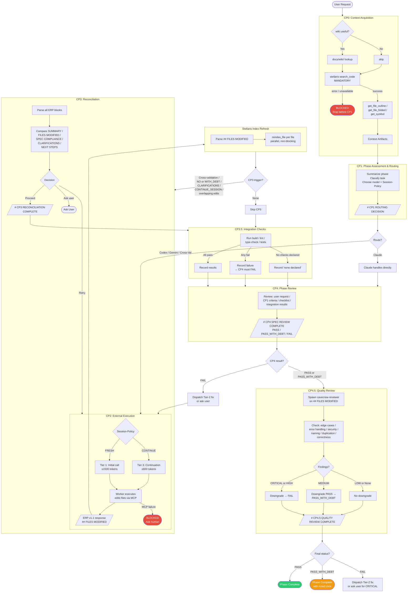
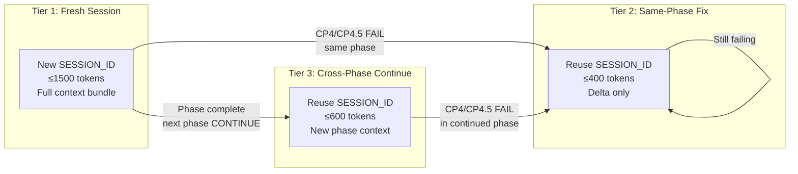
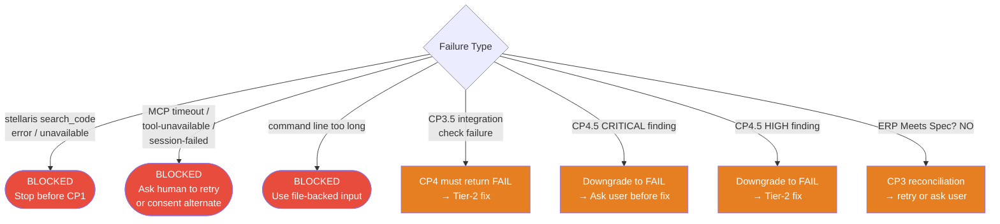

# CCG Workflow Architecture Diagrams

> Updated 2026-05-16 — includes stellaris reindex, CP3.5, CP4.5, failure paths.
> Render with any Mermaid-compatible tool.

## 1. High-Level System Architecture

## 2. Routing Decision Tree

## 3. Full Checkpoint Flow

## 4. Tier Prompt System

## 5. Failure & Recovery Paths

