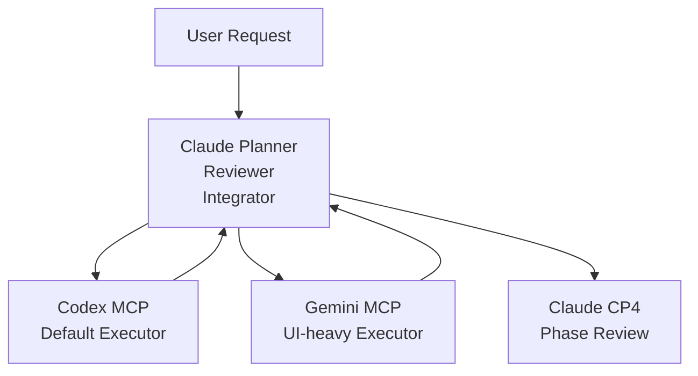
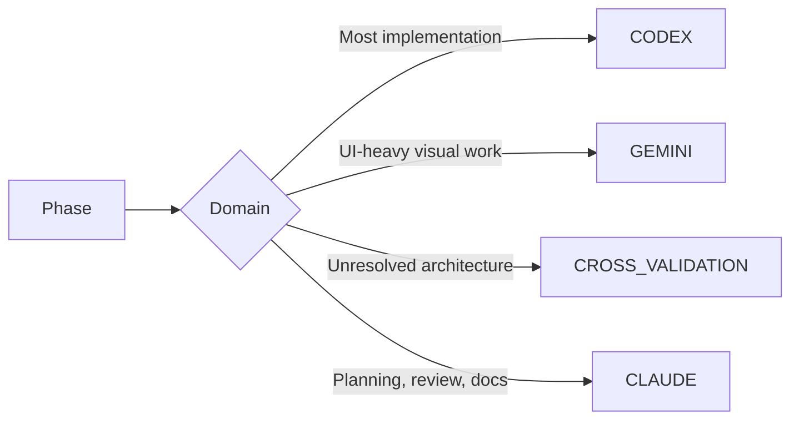
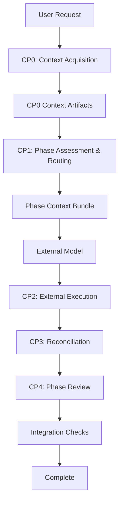

# CCG Workflow Architecture Diagrams

> Generated from CCG workflow analysis on 2026-03-24.
> Render with any Mermaid-compatible tool.

## 1. High-Level System Architecture

## 2. Routing Decision Tree

## 3. Checkpoint Flow

