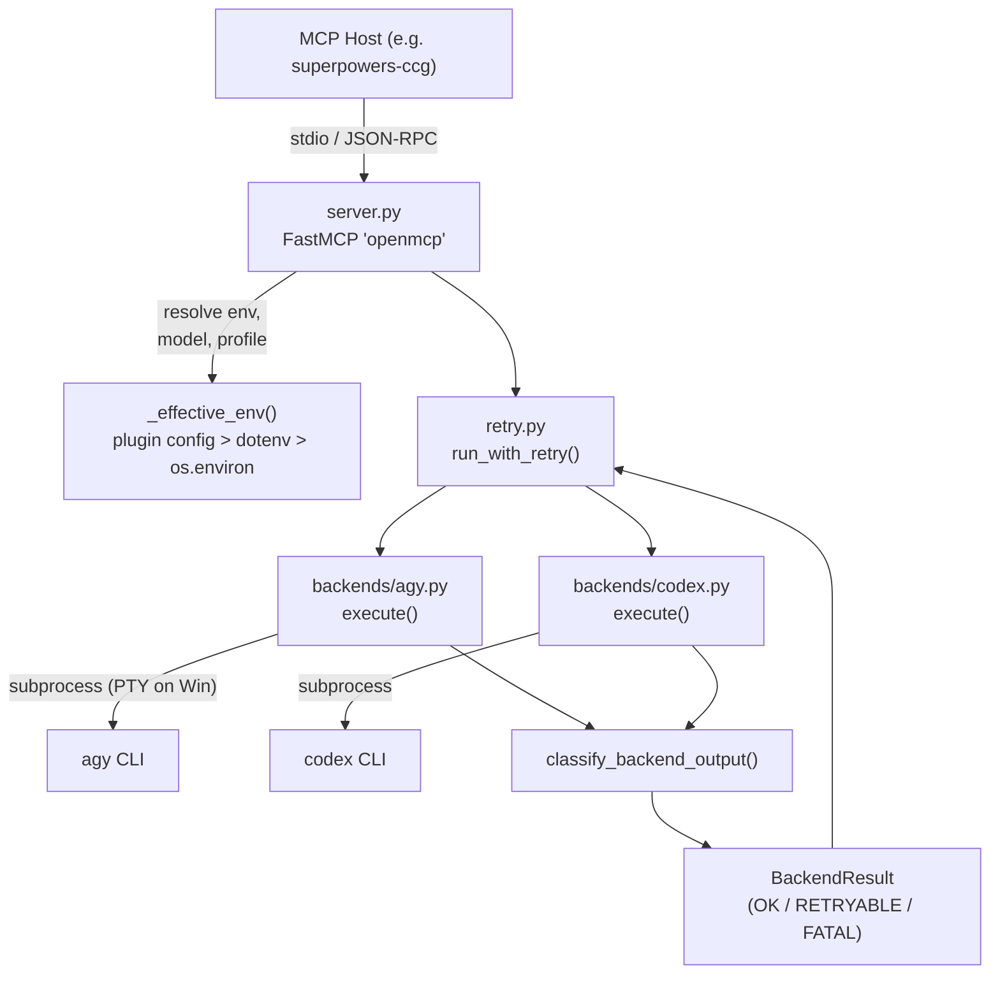

# Project Overview

**openmcp** is a unified [MCP](https://modelcontextprotocol.io/) server that
exposes a single `run` tool capable of dispatching prompts to two AI-coding
CLI backends — **agy** (Antigravity CLI / Gemini) and **codex** (OpenAI Codex CLI)
— with automatic retry, session continuity, model resolution, and a shared
output-classification pipeline. It is designed to be
embedded as an MCP server inside host agents (e.g. the `superpowers-ccg` plugin)
so that a coordinator can fan out coding tasks to heterogeneous backends through
a single, transport-agnostic interface.

## Repository Structure

```
openmcp/
├── pyproject.toml          # Project metadata, deps, build config (hatchling)
├── uv.lock                 # Pinned dependency lockfile (uv)
├── README.md               # One-line project description
├── .gitignore              # Ignored paths incl. legacy sub-repos
├── src/
│   └── openmcp/            # Installable Python package
│       ├── __init__.py     # Re-exports `backends`
│       ├── cli.py          # `openmcp` console-script entrypoint
│       ├── server.py       # FastMCP server surface; defines the `run` tool
│       ├── retry.py        # Exponential-backoff retry orchestrator
│       ├── logging_setup.py# Centralised rotating-file + faulthandler logging
│       └── backends/
│           ├── __init__.py # BackendResult dataclass + shared classifier
│           ├── agy.py      # Antigravity CLI backend (PTY on Windows)
│           └── codex.py    # Codex CLI backend (JSON-stream parsing)
└── tests/
    ├── conftest.py         # Auto-use fixture isolating ~/.openmcp/.env
    ├── test_smoke.py       # ~700-line offline unit/integration tests
    └── test_live_backends.py # Live end-to-end tests (require real CLIs)
```

- **`src/openmcp/`** — the installable package; everything under here ships.
- **`src/openmcp/backends/`** — one module per backend; each exports a
  `Params` dataclass and an `async execute(params) -> BackendResult` function.
- **`tests/`** — pytest suite with `conftest.py` home-dir isolation.

## Build & Development Commands

All commands assume **Python ≥ 3.12** and
[**uv**](https://docs.astral.sh/uv/) as the package/env manager.

```bash
# Create venv and install the package with dev extras
uv sync --all-extras

# Run the offline test suite (default: skips @live tests)
uv run pytest

# Run only the live integration tests (requires agy/codex on PATH)
uv run pytest -m live

# Run a specific test file
uv run pytest tests/test_smoke.py -v

# Start the MCP server over stdio (how hosts invoke it)
uv run openmcp

# Type-check (no mypy/pyright configured yet)
# > TODO: add mypy or pyright to dev deps and document here.

# Lint (no ruff/flake8 configured yet)
# > TODO: add ruff to dev deps and document here.

# Build a distributable wheel
uv build
```

## Code Style & Conventions

| Area | Convention |
|---------------------|-----------------------------------------------------|
| Formatter / linter | > TODO: configure ruff or black + isort |
| Type annotations | Used throughout; `from __future__ import annotations`|
| Naming | `snake_case` functions/vars; `PascalCase` classes |
| Private symbols | Prefixed with `_` (e.g. `_ENV_CODEX_MODEL_DEFAULT`) |
| Dataclasses | `@dataclass(slots=True)` for all param/result types |
| Exports | Every module defines `__all__` |
| Logging | Use `get_logger(name)` from `logging_setup`; never `print` |
| Constants | Module-level `UPPER_SNAKE`, prefixed with `_` when private |
| Commit messages | > TODO: define a commit-message template |

## Architecture Notes



**Data flow:**

1. The MCP host calls the `run` tool over stdio with a backend name, prompt,
   working directory, and optional session/model/retry parameters.
2. `server.py` resolves model and profile via a three-tier env precedence:
   *plugin config → `~/.openmcp/.env` → process environment*.
3. `run_with_retry()` calls the backend's `execute()` in a loop with
   exponential backoff + jitter. Session IDs are forwarded between retries
   to preserve conversation context.
4. Each backend spawns its CLI as a subprocess, streams or captures output,
   extracts the session ID through multiple fallback strategies, and passes
   the raw text into `classify_backend_output()`.
5. The shared classifier returns a `BackendResult` with outcome
   `OK | RETRYABLE | FATAL`, which the retry loop uses to decide whether
   to retry, abort, or return success.
6. The agy backend additionally supports **auto-continuation**: after a
   successful run it checks `task.md` for unchecked items and re-invokes
   itself up to 3 times.

## Testing Strategy

| Layer | Tool | Files | How to run |
|-------------|----------------|-------------------------------|-----------------------------------|
| Unit/smoke | pytest | `tests/test_smoke.py` | `uv run pytest` |
| Live / e2e | pytest + `@live`| `tests/test_live_backends.py` | `uv run pytest -m live` |

**Key details:**

- `conftest.py` patches `Path.home()` to an empty temp dir so the
  developer's real `~/.openmcp/.env` never leaks into tests.
- The default addopts (`-m 'not live'`) ensure live tests are skipped in
  normal runs.
- Live tests require `agy` and/or `codex` CLIs on `PATH`;
  tests that cannot find the CLI are skipped (not failed).
- Async tests use `pytest-asyncio`.
- > TODO: add CI pipeline configuration (GitHub Actions / similar).

## Security & Compliance

- **Secrets handling** — API keys and tokens are never stored in the
  repository. They are resolved at runtime from `~/.openmcp/.env` or
  process environment variables. No secrets appear in log output (though
  full CLI command lines are logged at `DEBUG` level; review before
  enabling in production).
- **Subprocess execution** — Both backends run external CLIs with
  `--dangerously-skip-permissions` (agy) or `--yolo` (codex). These flags bypass the CLIs' built-in
  safety prompts. The assumption is that the orchestrating agent has
  already vetted the prompt.
- **Dependency scanning** — > TODO: set up `pip-audit` or similar.
- **License** — > TODO: add a LICENSE file to the repository.

## Agent Guardrails

1. **Files never touched automatically:**
   - `~/.gemini/antigravity-cli/settings.json` — the agy backend
     temporarily patches this file during execution but always restores
     the original bytes afterward (atomic write + lock). Agents must not
     write to it outside of `_patch_model()`.
   - `uv.lock` — do not regenerate; only update via `uv lock`.
2. **Required reviews:**
   - Any change to `classify_backend_output()` or the retry loop must be
     reviewed; these control whether failures are retried or surfaced.
   - Changes to subprocess command construction (`cmd` lists in each
     backend) carry security implications and must be reviewed.
3. **Rate limits:**
   - The retry loop caps backoff at 8 000 ms with ±20 % jitter.
     `max_retries` is caller-controlled; there is no server-side hard cap.
   - The agy auto-continuation loop is hard-capped at 3 iterations
     (`_AGY_MAX_CONTINUATIONS`).
4. **Plugin self-disabling** — the agy backend runs without disabling plugins.

## Extensibility Hooks

### Environment variables

| Variable | Default | Purpose |
|-------------------------------|-------------------------------|--------------------------------------|
| `OPENMCP_CODEX_MODEL_DEFAULT` | *(none)* | Default Codex model |
| `OPENMCP_CODEX_PROFILE_DEFAULT`| `mcp_execution` | Default Codex profile |
| `OPENMCP_AGY_REASONING_MODEL` | `gemini-3.5-flash` | Model for agy reasoning mode |
| `OPENMCP_CODEX_REASONING_MODEL`| `gpt-5.5` | Model for codex reasoning mode |
| `OPENMCP_LOG_FILE` | `~/.openmcp/openmcp.log` | Override log file path |
| `OPENMCP_LOG_LEVEL` | `INFO` | Python log level name |

### Plugin config files

The server reads env overrides from the first matching file in `cwd`:
`mcp_config.json`, `.mcp.json`, or `mcp.json`, under the JSON path
`mcpServers.openmcp.env`.

### Adding a new backend

1. Create `src/openmcp/backends/<name>.py` with a `Params` dataclass and
   an `async execute(params) -> BackendResult` function.
2. Import and wire it into `server.py`'s `run()` function alongside the
   existing backends.
3. Add env-var entries for model defaults if needed.
4. Add smoke and live tests.

## Further Reading

- [README.md](README.md) — project elevator pitch.
- [pyproject.toml](pyproject.toml) — full dependency list, build config,
  and pytest markers.
- > TODO: create `docs/ARCH.md` with deeper architectural documentation.
- > TODO: create ADR directory for architectural decision records.
