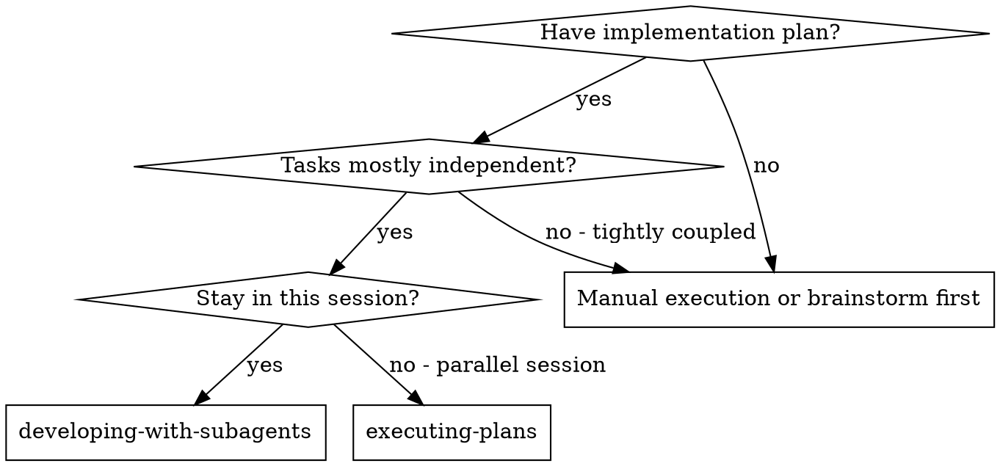
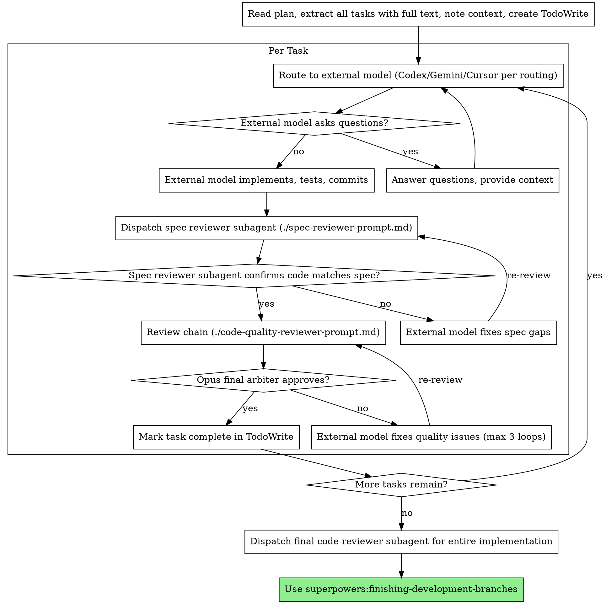

# Subagent-Driven Development

## Contents

- [Overview](#overview)
- [When to Use](#when-to-use)
- [The Process](#the-process)
- [Checkpoint Integration](#checkpoint-integration)
- [Related Skills](#related-skills)

## Overview

Execute plan by routing each task to the appropriate external model (Codex/Gemini/Cursor based on domain), with spec compliance review first (Opus), then Opus code quality review on every code-changing path.

**Core principle:** Route to external model per task + Opus review (spec then quality) = high quality, fast iteration. Claude orchestrates but never implements.

## Protocol Threshold (Required)

Follow `skills/shared/protocol-threshold.md`. The hook injects CP reminders automatically.

## When to Use



**vs. Executing Plans (parallel session):**

- Same session (no context switch)
- Fresh subagent per task (no context pollution)
- Two-stage review after each task: spec compliance first, then code quality
- Faster iteration (no human-in-loop between tasks)

## The Process

Copy this checklist template to track overall progress:

```
Plan Execution Progress:
- [ ] Plan read and all tasks extracted
- [ ] TodoWrite created with all tasks

Per-Task Checklist (copy for each):
Task N: [description]
- [ ] Checkpoint 1 (Task Analysis) applied
- [ ] 【CP1 Assessment】 output (standalone message)
- [ ] Implementer subagent dispatched
- [ ] Questions answered (if any)
- [ ] Implementation complete
- [ ] Checkpoint 3 (Quality Gate) applied
- [ ] Spec reviewer: ✅ compliant
- [ ] Opus review: ✅ approved
- [ ] Task marked complete

Final Steps:
- [ ] All tasks complete
- [ ] Final code reviewer dispatched
- [ ] finishing-development-branches invoked
```



## Prompt Templates

- `./implementer-prompt.md` - Dispatch implementer subagent (legacy template — prefer routing to external models via MCP)
- `./spec-reviewer-prompt.md` - Dispatch spec compliance reviewer subagent
- `./code-quality-reviewer-prompt.md` - Dispatch Opus quality review

## Model Strategy

Route implementation to external models. Claude orchestrates only.

| Role | Model | Selection Rule |
| ---- | ----- | -------------- |
| Backend implementation | Codex MCP (`mcp__codex__codex`) | CODEX routing |
| Frontend implementation | Gemini MCP (`mcp__gemini__gemini`) | GEMINI routing |
| DevOps implementation | Cursor MCP (`mcp__cursor__cursor`) | CURSOR routing |
| Spec Reviewer | Opus (default) | Always Opus |
| Quality Reviewer | Opus | Always Opus for code-changing paths |
| Exploration | `model: haiku` | Flexible |

## Collaboration Checkpoints

Apply checkpoint logic from `coordinating-multi-model-work/checkpoints.md` at these stages:

**► CP1 (Task Analysis):** Before dispatching implementer, apply `coordinating-multi-model-work/checkpoints.md`.

**► CP2 (Mid-Review):** During execution, apply `coordinating-multi-model-work/checkpoints.md` if triggered.

**► CP3 (Quality Gate):** After implementation, invoke spec reviewer, then Opus quality review per `coordinating-multi-model-work/review-chain.md`.

## Example Workflow

```
You: I'm using Subagent-Driven Development to execute this plan.

[Read plan file once: docs/plans/feature-plan.md]
[Extract all 5 tasks with full text and context]
[Create TodoWrite with all tasks]

Task 1: Hook installation script

[Get Task 1 text and context (already extracted)]
[Dispatch implementation subagent with full task text + context]

Implementer: "Before I begin - should the hook be installed at user or system level?"

You: "User level (~/.config/superpowers/hooks/)"

Implementer: "Got it. Implementing now..."
[Later] Implementer:
  - Implemented install-hook command
  - Added tests, 5/5 passing
  - Self-review: Found I missed --force flag, added it
  - Committed

[Dispatch spec compliance reviewer]
Spec reviewer: ✅ Spec compliant - all requirements met, nothing extra

[Dispatch Opus reviewer with diff + task context]
Opus: APPROVE — Good test coverage, clean implementation. No issues found.

[Mark Task 1 complete]

Task 2: Recovery modes

[Get Task 2 text and context (already extracted)]
[Dispatch implementation subagent with full task text + context]

Implementer: [No questions, proceeds]
Implementer:
  - Added verify/repair modes
  - 8/8 tests passing
  - Self-review: All good
  - Committed

[Dispatch spec compliance reviewer]
Spec reviewer: ❌ Issues:
  - Missing: Progress reporting (spec says "report every 100 items")
  - Extra: Added --json flag (not requested)

[Implementer fixes issues]
Implementer: Removed --json flag, added progress reporting

[Spec reviewer reviews again]
Spec reviewer: ✅ Spec compliant now

[Dispatch Opus reviewer]
Opus: Issues (Important): Magic number (100)

[Implementer fixes]
Implementer: Extracted PROGRESS_INTERVAL constant

[Re-submit Opus reviewer]
Opus: APPROVE

[Mark Task 2 complete]

...

[After all tasks]
[Dispatch final code-reviewer]
Final reviewer: All requirements met, ready to merge

Done!
```

## Advantages

**vs. Manual execution:**

- Subagents follow TDD naturally
- Fresh context per task (no confusion)
- Parallel-safe (subagents don't interfere)
- Subagent can ask questions (before AND during work)

**vs. Executing Plans:**

- Same session (no handoff)
- Continuous progress (no waiting)
- Review checkpoints automatic

**Efficiency gains:**

- No file reading overhead (controller provides full text)
- Controller curates exactly what context is needed
- Subagent gets complete information upfront
- Questions surfaced before work begins (not after)

**Quality gates:**

- Self-review catches issues before handoff
- Opus review per `coordinating-multi-model-work/review-chain.md`
- Review loops ensure fixes actually work (max 3 loops)
- Spec compliance prevents over/under-building

**Cost:**

- More subagent invocations (implementer + 2 reviewers per task)
- Controller does more prep work (extracting all tasks upfront)
- Review loops add iterations
- But catches issues early (cheaper than debugging later)

## Red Flags

**Never:**

- Skip reviews (spec compliance OR code quality)
- Proceed with unfixed issues
- Dispatch multiple implementation subagents in parallel (conflicts)
- Make subagent read plan file (provide full text instead)
- Skip scene-setting context (subagent needs to understand where task fits)
- Ignore subagent questions (answer before letting them proceed)
- Accept "close enough" on spec compliance (spec reviewer found issues = not done)
- Skip review loops (reviewer found issues = implementer fixes = review again)
- Let implementer self-review replace actual review (both are needed)
- **Start code quality review before spec compliance is ✅** (wrong order)
- Move to next task while either review has open issues
- Skip Opus review
- Exceed 3 fix-review loops without escalating to user
- Let Claude write implementation code (Claude is orchestrator-only)

**If subagent asks questions:**

- Answer clearly and completely
- Provide additional context if needed
- Don't rush them into implementation

**If reviewer finds issues:**

- Implementer (same subagent) fixes them
- Reviewer reviews again
- Repeat until approved
- Don't skip the re-review

**If subagent fails task:**

- Dispatch fix subagent with specific instructions
- Don't try to fix manually (context pollution)

## Integration

**Required workflow skills:**

- **superpowers:writing-plans** - Creates the plan this skill executes
- **superpowers:requesting-code-review** - Code review template for reviewer subagents
- **superpowers:finishing-development-branches** - Complete development after all tasks
- **superpowers:coordinating-multi-model-work** - Multi-model routing for task execution

**Subagents should use:**

- **superpowers:practicing-test-driven-development** - Subagents follow TDD for each task

**Alternative workflow:**

- **superpowers:executing-plans** - Use for parallel session instead of same-session execution

## Multi-Model Task Dispatch

See `skills/shared/multi-model-integration-section.md` for routing, invocation, and fallback rules.
