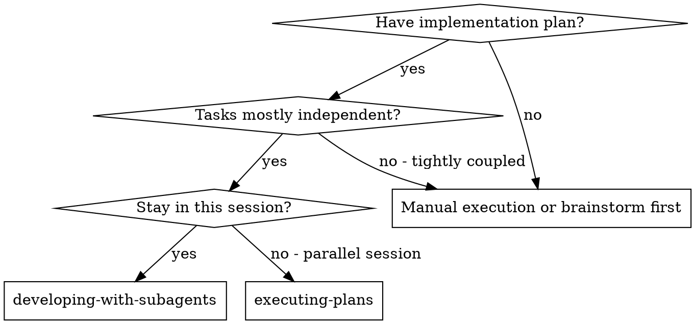
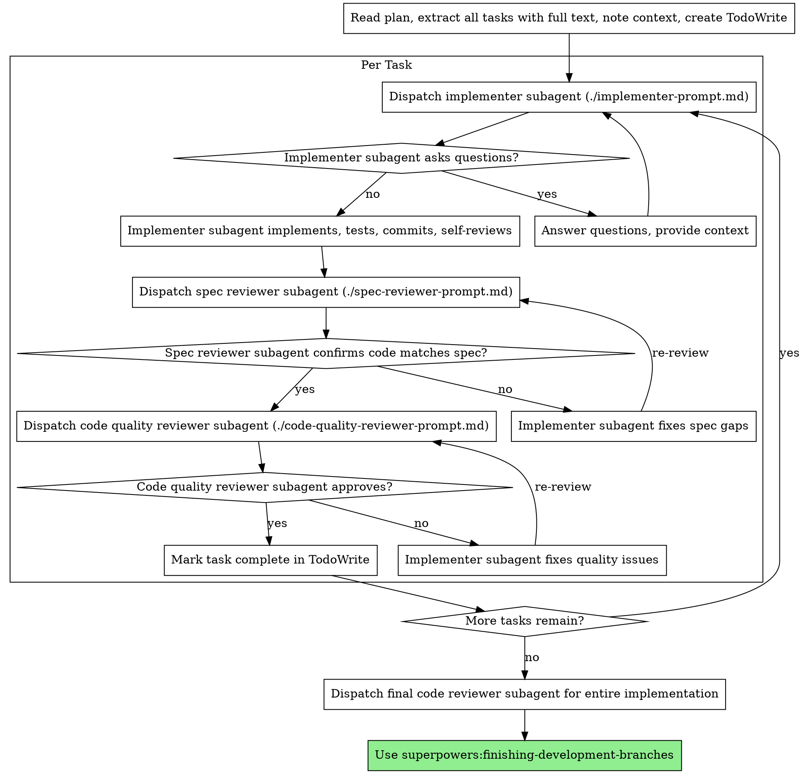

# Subagent-Driven Development

## Contents
- [Overview](#overview)
- [When to Use](#when-to-use)
- [The Process](#the-process)
- [Checkpoint Integration](#checkpoint-integration)
- [Related Skills](#related-skills)

## Overview

Execute plan by dispatching fresh subagent per task, with two-stage review after each: spec compliance review first, then code quality review.

**Core principle:** Fresh subagent per task + two-stage review (spec then quality) = high quality, fast iteration

## 协议门槛（必须）

遵循 hooks 注入的【CP 协议门槛】要求：
- 首次调用 Task 前：先单独输出【CP1 评估】（含字段；同消息不得包含 tool 调用）
- 声称完成/请求 review/宣称验证通过前：先单独输出【CP3 评估】（含字段；同消息不得包含 tool 调用）

不满足 → 立刻停止，先补齐 CP 块再继续。

## When to Use



**vs. Executing Plans (parallel session):**
- Same session (no context switch)
- Fresh subagent per task (no context pollution)
- Two-stage review after each task: spec compliance first, then code quality
- Faster iteration (no human-in-loop between tasks)

## The Process

Copy this checklist template to track overall progress:

```
Plan Execution Progress:
- [ ] Plan read and all tasks extracted
- [ ] TodoWrite created with all tasks

Per-Task Checklist (copy for each):
Task N: [description]
- [ ] Checkpoint 1 (Task Analysis) applied
- [ ] 【CP1 评估】已输出（单独一条消息）
- [ ] Implementer subagent dispatched
- [ ] Questions answered (if any)
- [ ] Implementation complete
- [ ] Checkpoint 3 (Quality Gate) applied
- [ ] Spec reviewer: ✅ compliant
- [ ] Code quality reviewer: ✅ approved
- [ ] Task marked complete

Final Steps:
- [ ] All tasks complete
- [ ] Final code reviewer dispatched
- [ ] finishing-development-branches invoked
```



## Prompt Templates

- `./implementer-prompt.md` - Dispatch implementer subagent
- `./spec-reviewer-prompt.md` - Dispatch spec compliance reviewer subagent
- `./code-quality-reviewer-prompt.md` - Dispatch code quality reviewer subagent

## Claude Model Strategy

Choose model based on task type:

| Subagent | Model | Freedom |
|----------|-------|---------|
| Implementer | `model: sonnet` | Low - always use Sonnet for code |
| Spec/Quality Reviewer | Opus (default) | Low - always use Opus for review |
| Exploration | `model: haiku` | Medium - prefer Haiku, flexible |

## Collaboration Checkpoints

Apply checkpoint logic from `coordinating-multi-model-work/checkpoints.md` at these stages:

**► Checkpoint 1 (Task Analysis):** Before dispatching implementer subagent:
- Collect: task files, description, complexity
- **Output a standalone `【CP1 评估】` block to the user BEFORE the first Task tool call**
- Check critical task conditions → Match: invoke expert model
- Evaluate general task signals → Positive: invoke

**► Checkpoint 2 (Mid-Review):** During subagent execution:
- Subagent asks question requiring external expertise → invoke domain expert
- Multiple implementation approaches debated → invoke cross-validation

**► Checkpoint 3 (Quality Gate):** After subagent completes, before spec review:
- Implementation complete → invoke domain expert for pre-review assessment

## Example Workflow

```
You: I'm using Subagent-Driven Development to execute this plan.

[Read plan file once: docs/plans/feature-plan.md]
[Extract all 5 tasks with full text and context]
[Create TodoWrite with all tasks]

Task 1: Hook installation script

[Get Task 1 text and context (already extracted)]
[Dispatch implementation subagent with full task text + context]

Implementer: "Before I begin - should the hook be installed at user or system level?"

You: "User level (~/.config/superpowers/hooks/)"

Implementer: "Got it. Implementing now..."
[Later] Implementer:
  - Implemented install-hook command
  - Added tests, 5/5 passing
  - Self-review: Found I missed --force flag, added it
  - Committed

[Dispatch spec compliance reviewer]
Spec reviewer: ✅ Spec compliant - all requirements met, nothing extra

[Get git SHAs, dispatch code quality reviewer]
Code reviewer: Strengths: Good test coverage, clean. Issues: None. Approved.

[Mark Task 1 complete]

Task 2: Recovery modes

[Get Task 2 text and context (already extracted)]
[Dispatch implementation subagent with full task text + context]

Implementer: [No questions, proceeds]
Implementer:
  - Added verify/repair modes
  - 8/8 tests passing
  - Self-review: All good
  - Committed

[Dispatch spec compliance reviewer]
Spec reviewer: ❌ Issues:
  - Missing: Progress reporting (spec says "report every 100 items")
  - Extra: Added --json flag (not requested)

[Implementer fixes issues]
Implementer: Removed --json flag, added progress reporting

[Spec reviewer reviews again]
Spec reviewer: ✅ Spec compliant now

[Dispatch code quality reviewer]
Code reviewer: Strengths: Solid. Issues (Important): Magic number (100)

[Implementer fixes]
Implementer: Extracted PROGRESS_INTERVAL constant

[Code reviewer reviews again]
Code reviewer: ✅ Approved

[Mark Task 2 complete]

...

[After all tasks]
[Dispatch final code-reviewer]
Final reviewer: All requirements met, ready to merge

Done!
```

## Advantages

**vs. Manual execution:**
- Subagents follow TDD naturally
- Fresh context per task (no confusion)
- Parallel-safe (subagents don't interfere)
- Subagent can ask questions (before AND during work)

**vs. Executing Plans:**
- Same session (no handoff)
- Continuous progress (no waiting)
- Review checkpoints automatic

**Efficiency gains:**
- No file reading overhead (controller provides full text)
- Controller curates exactly what context is needed
- Subagent gets complete information upfront
- Questions surfaced before work begins (not after)

**Quality gates:**
- Self-review catches issues before handoff
- Two-stage review: spec compliance, then code quality
- Review loops ensure fixes actually work
- Spec compliance prevents over/under-building
- Code quality ensures implementation is well-built

**Cost:**
- More subagent invocations (implementer + 2 reviewers per task)
- Controller does more prep work (extracting all tasks upfront)
- Review loops add iterations
- But catches issues early (cheaper than debugging later)

## Red Flags

**Never:**
- Skip reviews (spec compliance OR code quality)
- Proceed with unfixed issues
- Dispatch multiple implementation subagents in parallel (conflicts)
- Make subagent read plan file (provide full text instead)
- Skip scene-setting context (subagent needs to understand where task fits)
- Ignore subagent questions (answer before letting them proceed)
- Accept "close enough" on spec compliance (spec reviewer found issues = not done)
- Skip review loops (reviewer found issues = implementer fixes = review again)
- Let implementer self-review replace actual review (both are needed)
- **Start code quality review before spec compliance is ✅** (wrong order)
- Move to next task while either review has open issues

**If subagent asks questions:**
- Answer clearly and completely
- Provide additional context if needed
- Don't rush them into implementation

**If reviewer finds issues:**
- Implementer (same subagent) fixes them
- Reviewer reviews again
- Repeat until approved
- Don't skip the re-review

**If subagent fails task:**
- Dispatch fix subagent with specific instructions
- Don't try to fix manually (context pollution)

## Integration

**Required workflow skills:**
- **superpowers:writing-plans** - Creates the plan this skill executes
- **superpowers:requesting-code-review** - Code review template for reviewer subagents
- **superpowers:finishing-development-branches** - Complete development after all tasks
- **superpowers:coordinating-multi-model-work** - Multi-model routing for task execution

**Subagents should use:**
- **superpowers:practicing-test-driven-development** - Subagents follow TDD for each task

**Alternative workflow:**
- **superpowers:executing-plans** - Use for parallel session instead of same-session execution

## Multi-Model Task Dispatch

**Related skill:** superpowers:coordinating-multi-model-work

At checkpoints, apply semantic routing from `coordinating-multi-model-work/routing-decision.md`:

- **Routing decision:**
  - Clear backend task (API, database, server logic) → CODEX
  - Clear frontend task (UI, components, styles) → GEMINI
  - Full-stack integration or critical task → CROSS_VALIDATION
  - General task requiring complete context → CLAUDE subagent

- **Check for Model Hint:** If task includes hint, use as guidance

- **Notify user:** "我将使用 [model/subagent] 来实现 [task name]"

- **Call MCP tool** with English prompts (see `coordinating-multi-model-work/INTEGRATION.md` for templates). Use Codex MCP (`mcp__codex__codex`) for backend, Gemini MCP (`mcp__gemini__gemini`) for frontend, and call both in parallel for CROSS_VALIDATION.

**Full checkpoint logic:** See `coordinating-multi-model-work/checkpoints.md`

**Fallback (Fail-Closed):** If external models are required but unavailable or time out, STOP and follow `coordinating-multi-model-work/GATE.md` (do not proceed with task completion output).
