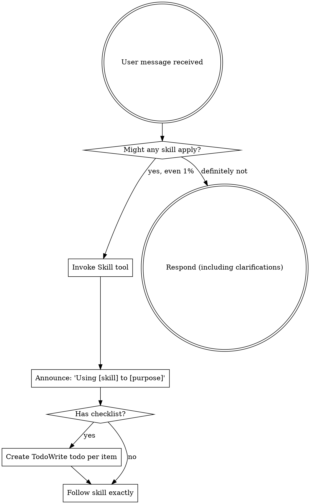

> **⚠️ 极其重要：**
>
> 如果你认为有哪怕 1% 的可能性某个 skill 适用于你正在做的事情，你**必须**调用该 skill。
>
> **如果一个 skill 适用于你的任务，你没有选择。你必须使用它。**
>
> 这不是可协商的。这不是可选的。你不能为自己找理由逃避。

## How to Access Skills

**In Claude Code:** Use the `Skill` tool. When you invoke a skill, its content is loaded and presented to you—follow it directly. Never use the Read tool on skill files.

**In other environments:** Check your platform's documentation for how skills are loaded.

# Using Skills

## The Rule

**Invoke relevant or requested skills BEFORE any response or action.** Even a 1% chance a skill might apply means that you should invoke the skill to check. If an invoked skill turns out to be wrong for the situation, you don't need to use it.

## Red Flags

These thoughts mean STOP—you're rationalizing:

| Thought | Reality |
|---------|---------|
| "This is just a simple question" | Questions are tasks. Check for skills. |
| "I need more context first" | Skill check comes BEFORE clarifying questions. |
| "Let me explore the codebase first" | Skills tell you HOW to explore. Check first. |
| "I can check git/files quickly" | Files lack conversation context. Check for skills. |
| "Let me gather information first" | Skills tell you HOW to gather information. |
| "This doesn't need a formal skill" | If a skill exists, use it. |
| "I remember this skill" | Skills evolve. Read current version. |
| "This doesn't count as a task" | Action = task. Check for skills. |
| "The skill is overkill" | Simple things become complex. Use it. |
| "I'll just do this one thing first" | Check BEFORE doing anything. |
| "This feels productive" | Undisciplined action wastes time. Skills prevent this. |
| "I know what that means" | Knowing the concept ≠ using the skill. Invoke it. |

## Skill Priority

When multiple skills could apply, use this order:

1. **Process skills first** (brainstorming, debugging) - these determine HOW to approach the task
2. **Implementation skills second** (frontend-design, mcp-builder) - these guide execution

"Let's build X" → brainstorming first, then implementation skills.
"Fix this bug" → debugging first, then domain-specific skills.

## Skill Types

**Rigid** (TDD, debugging): Follow exactly. Don't adapt away discipline.

**Flexible** (patterns): Adapt principles to context.

The skill itself tells you which.

## User Instructions

Instructions say WHAT, not HOW. "Add X" or "Fix Y" doesn't mean skip workflows.

## Claude Model Strategy for Subagents

| Model | Use For |
|-------|---------|
| Opus (default) | Review, architecture, complex reasoning |
| `model: sonnet` | Implementation, coding |
| `model: haiku` | Exploration, search |

See `developing-with-subagents` for details.

## Multi-Model Capability (Codex + Gemini)

If a task would benefit from specialized external models, you MUST use `superpowers:coordinating-multi-model-work` and follow `coordinating-multi-model-work/GATE.md`.

Fail-closed rule: if Routing != CLAUDE and the external call cannot be completed (timeout/tool/permissions), you MUST STOP and report BLOCKED (no final answer).
